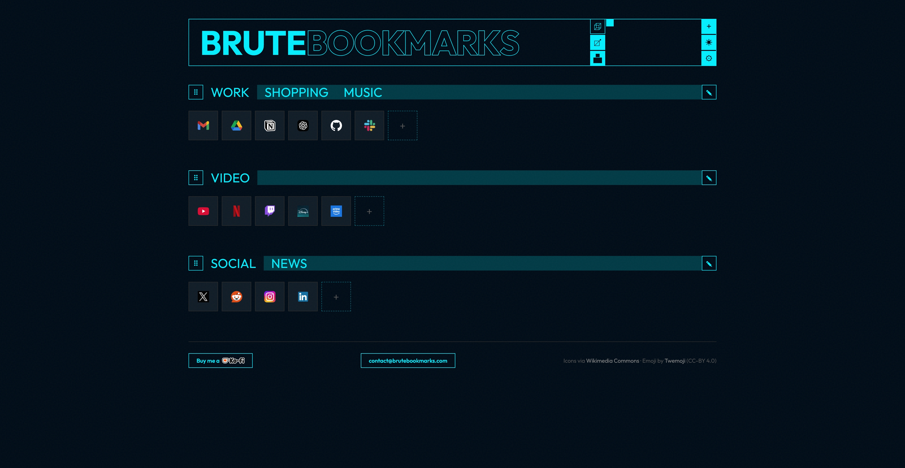
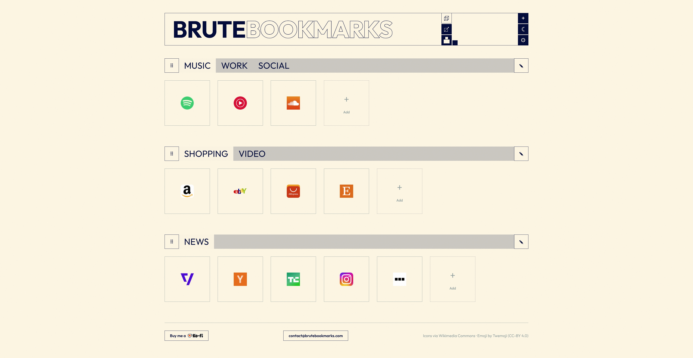
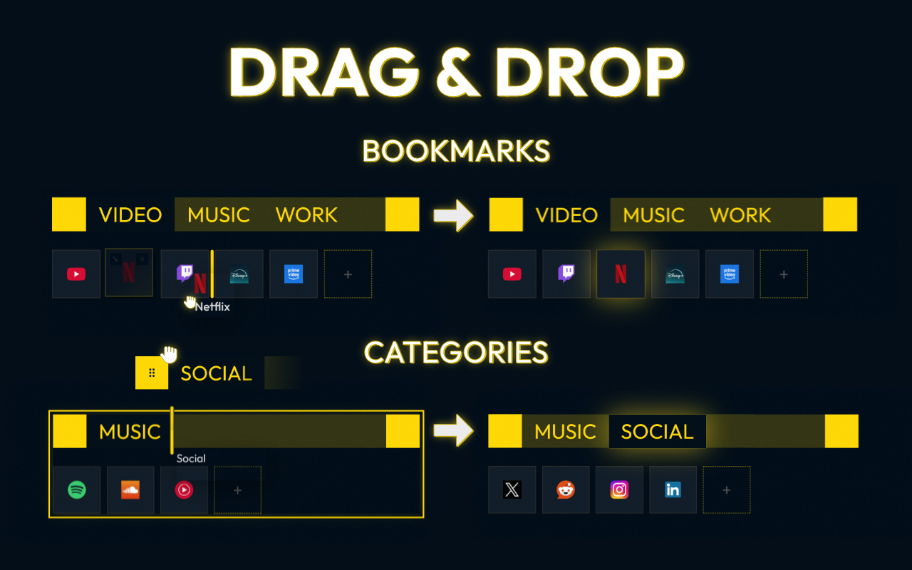
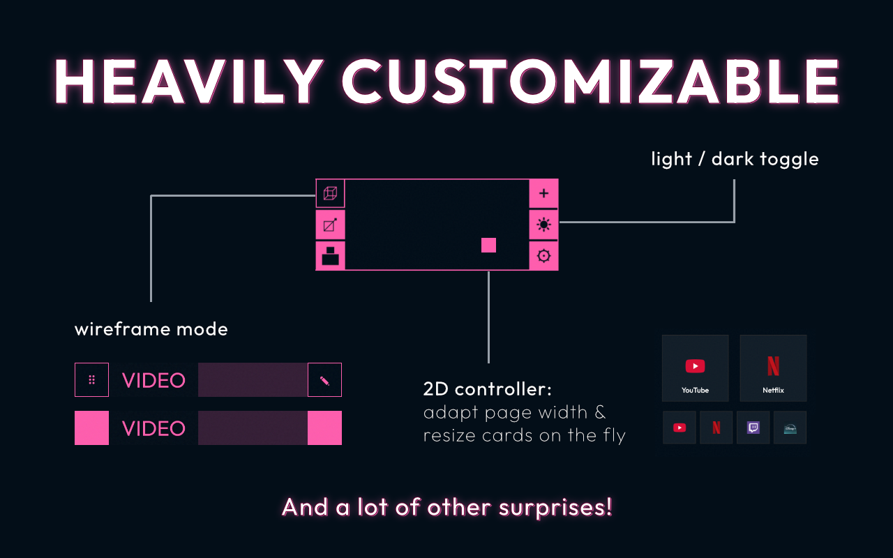
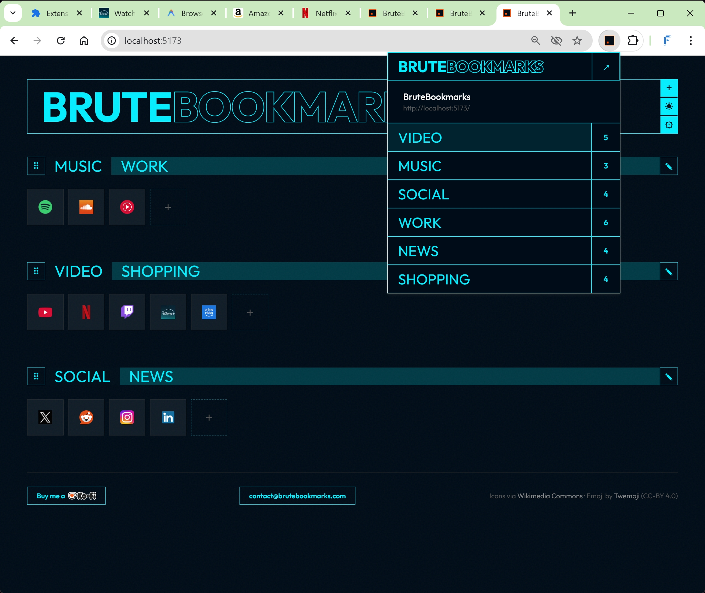

# Brute Bookmarks

A visual bookmark dashboard with a brutalist design. Organize your bookmarks into categories and tab groups, rearrange everything with drag and drop, and sync across all your devices in real time.

**[Try it live at brutebookmarks.com](https://brutebookmarks.com)**

No account required. No ads. No tracking. Fun. Flexible. Private.





## Why BruteBookmarks

- **Works without an account** — Full local experience, no sign-up wall. Your data stays in your browser until you decide otherwise.
- **Privacy-first** — No ads, no tracking, no data selling, no bookmark analysis. When used locally, nothing leaves your browser.
- **Real-time sync** — Sign in and your bookmarks appear on every device instantly. Not eventual consistency — actually real time.
- **Brutalist design** — A distinctive visual identity. Looks like nothing else in the category.
- **Open source** — MIT licensed. Read every line of code.

## Features

### Organization
- **Categories** — Group bookmarks into named categories
- **Tab Groups** — Drag one category onto another to combine them as tabs
- **Drag & Drop** — Reorder bookmarks, categories, and tab groups freely. Move bookmarks between categories.



### Customization
- **Dark & Light Themes** — Toggle with one click
- **Accent Colors** — Pick any color, the entire interface adapts
- **Wireframe Mode** — A stripped-back, outlined UI style
- **Card Size & Page Width** — A 2D controller to resize cards and page width simultaneously
- **Bar Scale** — Cycle through category bar heights to find your density
- **Show or Hide Card Names** — Clean icons only, or icons with labels



### Smart Icons
- **Favicon Auto-Fetch** — Grab site favicons with one click
- **Wikimedia Search** — Find high-quality logos from Wikimedia Commons
- **Emoji Icons** — Use Twemoji icons for bookmarks
- **Custom Upload** — Upload your own icons (drag-and-drop supported)

### Data Management
- **Import** — From Chrome's built-in bookmarks, JSON backups, or browser HTML exports
- **Export** — Backup all your data as JSON at any time
- **Erase** — Delete everything with one button. Full control over your data.

## Browser Extension

A companion extension for Chrome and Firefox. Click the icon on any page to save it.



- **One-click save** — One category? One click. Multiple? Pick from a dropdown.
- **Duplicate detection** — Already saved a page? The extension tells you where, with the option to save it elsewhere.
- **Category overview** — See all your categories and bookmark counts at a glance.

Built with the [WXT framework](https://wxt.dev/) from a single codebase.

```bash
cd extension
npm install
npx wxt          # Chrome dev
npx wxt --browser firefox  # Firefox dev
```

## Tech Stack

| Layer | Technology |
|-------|-----------|
| Frontend | TypeScript, Vite, CSS custom properties |
| Backend | [Convex](https://convex.dev) (real-time subscriptions + mutations) |
| Auth | [Clerk](https://clerk.com) |
| Hosting | Vercel (frontend) + Convex Cloud (backend) |
| Extension | [WXT](https://wxt.dev/) (Chrome + Firefox from single codebase) |

## Getting Started

```bash
# Clone and install
git clone https://github.com/HNTBO/brutebookmarks.git
cd brutebookmarks
npm install

# Start dev server (port 5173)
npm run dev
```

### Environment Variables

Create a `.env` file at the root:

```env
VITE_CLERK_PUBLISHABLE_KEY=pk_test_...
VITE_CONVEX_URL=https://...convex.cloud
```

For Vercel deployment, also set `CONVEX_DEPLOY_KEY` and use build command:
```
npx convex deploy && vite build
```

## License

[MIT](LICENSE)

## Credits

- Icons: [Wikimedia Commons](https://commons.wikimedia.org), [Twemoji](https://github.com/twitter/twemoji), [DuckDuckGo](https://duckduckgo.com) favicons
- Auth: [Clerk](https://clerk.com)
- Backend: [Convex](https://convex.dev)
- Extension framework: [WXT](https://wxt.dev/)

---

Made by a solo developer. No venture capital. No growth hacks. Just a bookmark manager that respects your time and your data.

[brutebookmarks.com](https://brutebookmarks.com) · [contact@brutebookmarks.com](mailto:contact@brutebookmarks.com) · [Ko-fi](https://ko-fi.com/hntbo)
