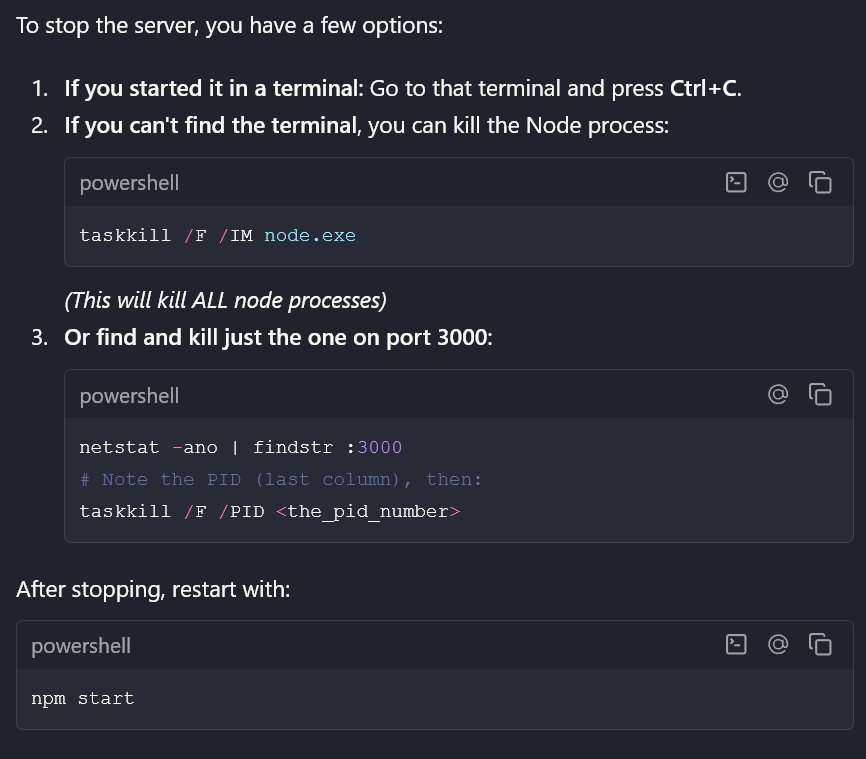

To stop the server, you have a few options:

If you started it in a terminal: Go to that terminal and press Ctrl+C.
If you can't find the terminal, you can kill the Node process:
powershell
taskkill /F /IM node.exe
(This will kill ALL node processes)
Or find and kill just the one on port 3000:
powershell
netstat -ano | findstr :3000
# Note the PID (last column), then:
taskkill /F /PID <the_pid_number>

